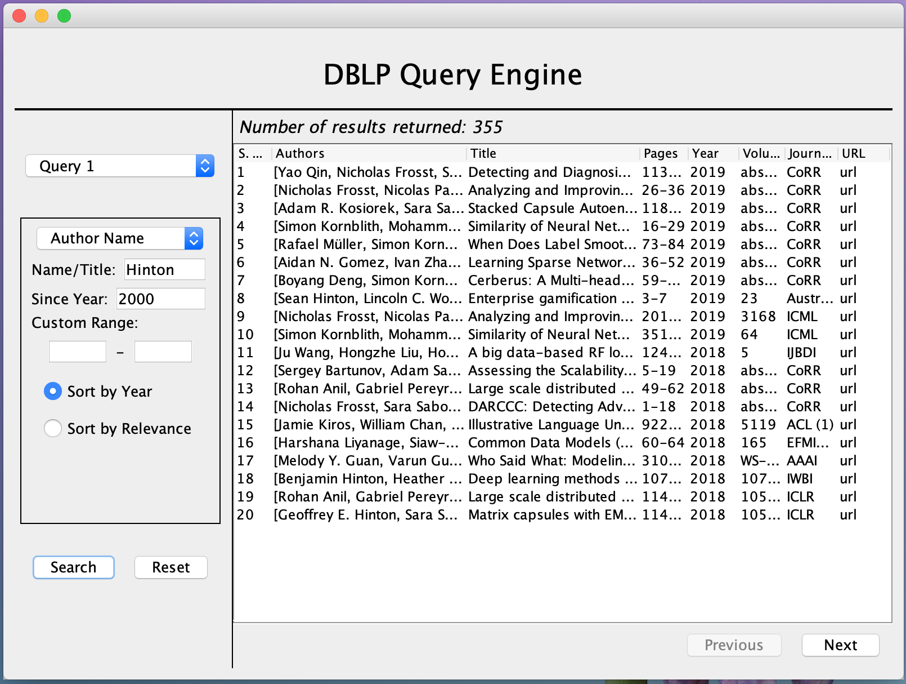
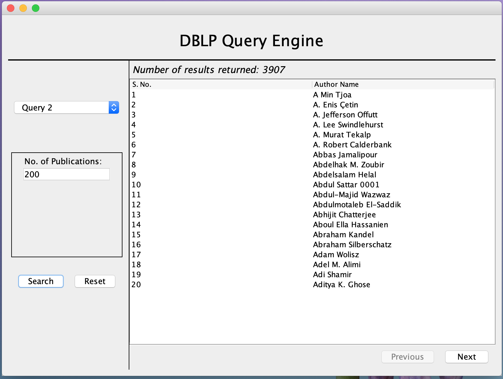
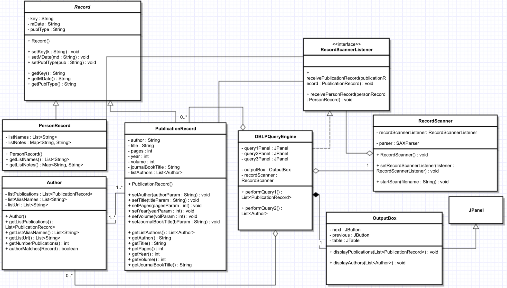
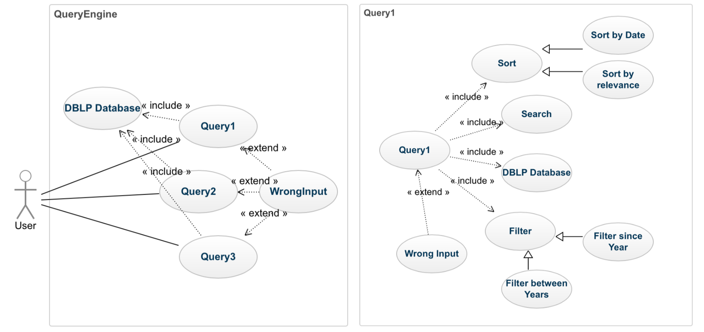
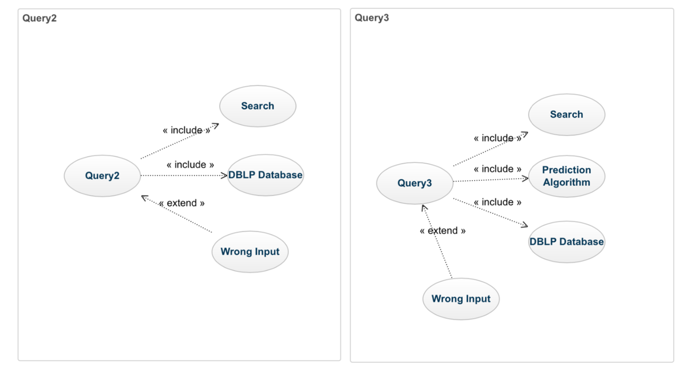

# DBLP-Query-Engine

### Introduction
- This is a Java-based [DBLP](https://dblp.uni-trier.de/) query application
- It supports two types of queries on the DBLP bibliography:
    - _Query 1_: search using publication title(s) or author name; filter/sort output via date, relevance
    - _Query 2_: find authors having more than `K` publications, where `K` is given by user 
- This application was developed as part of our course project for _CSE201: Advanced Programming_

### Repository structure
-  `src/` contains entire java source code
    - `src/DBLPQueryEngine.java` contains the `main()` function of the application
- `build.sh` is the bash shell-script which can be used to build the application from source
- `img/` contains screenshots, UML class diagram, and use case diagrams

### Installation
- You should have java development environment installed on your machine (`java` and `javac` commands)
- Download `dbpl.xml` (~2.6GB after unzipping) and `dblp.dtd` from [here](https://dblp.uni-trier.de/) (see section _XML data_ on this page) and place both the files in the root directory of this project

### Build
- First, make sure you have completed installation steps mentioned above
- `cd` into the root of this repository and run command  `./build.sh`

### Screenshots
- Query 1
    
- Query 2
    

### UML Class Diagram
- Following UML class diagram depicts the relation between various classes of this application
    
    
### Use Case Diagrams

